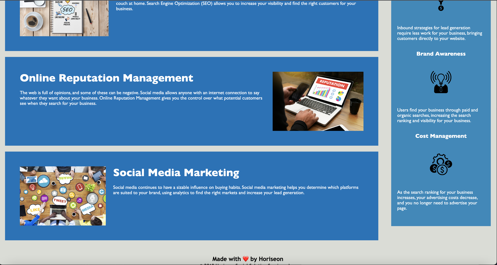

# Horiseon-Refactoring

Refactoring of existing code for marketing agency website in order to make it more accessible and easier to read by developers and search engines for SEO purposes.

The motivation of the project was to refactor the existing code with semantic HTML elements and accessibility features in order to make the webpage more accessible to screen readers and other accessibility technology. 

The semantic HTML tags were put in place to help make the code more readable for developers and improve SEO function. This project was created to practice refactoring, a duty that developers are given all time in their careers. 

The refactoring of the code with semantic HTML and accessibility attributes allowed the code to be more readily accessible and allow improvement in SEO for the webpage. 

Throughout this project, I learned the importance of semantic HTML in code. Other developers need to be able to read code without having to go back and forth between the browser to find out which lines control which elements. Accessibility is a neccesity in web development as it allows all people to access the same website without problems regarding visual impairments.

## Installation

Go to the provided URL to access the webpage on your browser:

<<<<<<< HEAD
GitHub URL: https://github.com/GriffinDesign/Horiseon-Refactoring

Webpage URL: https://griffindesign.github.io/Horiseon-Refactoring/

=======
URL: https://griffindesign.github.io/Horiseon-Refactoring/
>>>>>>> 0b127414c9137e7935788692201d2b4e77e408bd

## License

MIT License

Copyright (c) 2022 GriffinDesign

Permission is hereby granted, free of charge, to any person obtaining a copy
of this software and associated documentation files (the "Software"), to deal
in the Software without restriction, including without limitation the rights
to use, copy, modify, merge, publish, distribute, sublicense, and/or sell
copies of the Software, and to permit persons to whom the Software is
furnished to do so, subject to the following conditions:

The above copyright notice and this permission notice shall be included in all
copies or substantial portions of the Software.

THE SOFTWARE IS PROVIDED "AS IS", WITHOUT WARRANTY OF ANY KIND, EXPRESS OR
IMPLIED, INCLUDING BUT NOT LIMITED TO THE WARRANTIES OF MERCHANTABILITY,
FITNESS FOR A PARTICULAR PURPOSE AND NONINFRINGEMENT. IN NO EVENT SHALL THE
AUTHORS OR COPYRIGHT HOLDERS BE LIABLE FOR ANY CLAIM, DAMAGES OR OTHER
LIABILITY, WHETHER IN AN ACTION OF CONTRACT, TORT OR OTHERWISE, ARISING FROM,
OUT OF OR IN CONNECTION WITH THE SOFTWARE OR THE USE OR OTHER DEALINGS IN THE
SOFTWARE.

